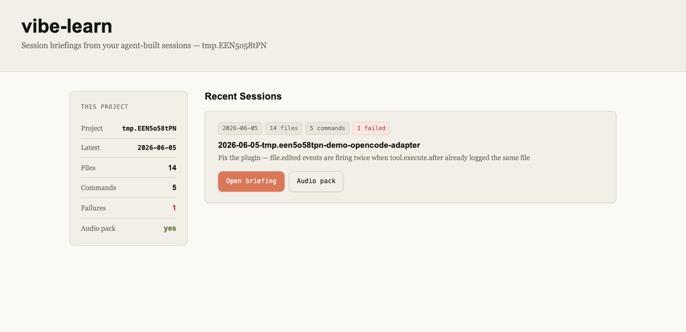
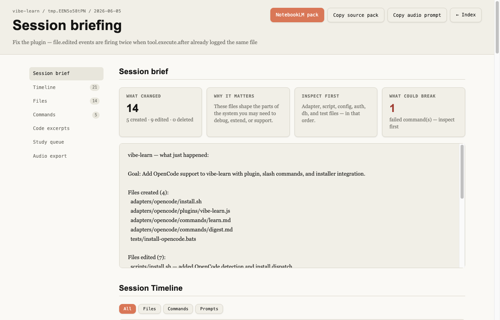

# vibe-learn

**Learn as your AI coding assistant builds.**

You can outsource your thinking, but you can't outsource your understanding.

vibe-learn watches what Claude Code, Codex, or OpenCode does during a session and helps you understand what was built, why, and how — without changing how you work.

---

**New here?** Follow the [Getting Started guide](GETTING_STARTED.md) for a step-by-step first session walkthrough.

---

## Install

```bash
curl -fsSL https://raw.githubusercontent.com/gkaria/vibe-learn/main/scripts/setup.sh | bash
```

Installs to `~/.vibe-learn/` and registers hooks globally for every AI assistant detected on your machine. **Requires `jq`** — `brew install jq` / `apt-get install jq`.

To update: re-run the same command.

---

## What happens automatically

After every AI response that touches files or runs commands, vibe-learn:

- Appends every action to `.vibe-learn/session-log.jsonl`
- Writes a pause summary to `.vibe-learn/pause-summary.txt`
- Injects that summary into your assistant's next context window (Claude Code)
- Regenerates the session briefing in the background

You'll see something like this appear in Claude's context after each response:

```
⏸ vibe-learn — what just happened:
Goal: add JWT auth middleware

  ✦ Created src/middleware/auth.ts
  ✦ Edited src/routes/user.ts
  ✦ Ran: npm install jsonwebtoken

 /learn [question]  ·  /digest  ·  vibe-learn briefing  ·  vibe-learn audio-prep
```

---

## When you want to understand

### Claude Code

```
/learn                              — explain what just happened
/learn why did we add middleware?   — answer a specific question
/digest                             — full structured session report
/quiz                               — check your understanding of this session
/quiz review                        — re-quiz concepts that are shaky or due again
```

### Codex

```
Use vibe-learn to learn what happened.
Use vibe-learn to answer: why did we install bcrypt?
Use vibe-learn to create a digest.
Use vibe-learn to quiz me on this session.
```

### OpenCode

```
/learn
/learn why did we add middleware?
/digest
/quiz
```

---

## What it looks like

Continuing the JWT session from above:

**`/learn`** — a plain-language recap, grounded in the actual log:

```
📘 What just happened:

• Added JWT auth middleware (src/middleware/auth.ts) — every request to a
  protected route now passes a token check before reaching the handler
• Wired it into the user routes (src/routes/user.ts), so /profile and
  /settings require a valid token
• Installed jsonwebtoken to sign and verify tokens
• Pattern worth knowing: middleware ordering — auth runs before the route
  handlers, so handlers can safely assume req.user exists
```

**`/digest`** — the structured session report:

```
## 📘 Session Digest

### What Was Built
JWT authentication for the user routes: a reusable auth middleware that
verifies tokens and attaches the decoded user to the request.

### Key Decisions
- Middleware over per-route checks — one enforcement point, no duplication
- jsonwebtoken over hand-rolling — battle-tested signing and expiry handling

### Patterns Used
- Express middleware chaining and ordering
- Fail-closed auth (reject first, then continue)

### Things to Study
- [ ] How JWT expiry and refresh interact
- [ ] What happens to routes registered before the auth middleware
- [ ] (carried over from Jul 2) Environment-based config for secrets
```

**`/quiz`** — one question at a time, graded against what actually happened:

```
Question 1 of 3: The auth check lives in middleware instead of inside each
route handler. What does that buy us — and what's the risk when someone
adds a new route later?

> no repeated checks in every handler, and new routes are protected
  automatically?

Right on the first half — one enforcement point, no duplication. One nuance
you missed: routes are only protected if they're registered *after* the
middleware. A new route mounted above app.use(auth) skips the check
entirely. That ordering is the thing to remember.

  ✔ recorded: express-middleware-ordering → shaky
```

That last line is the knowledge ledger at work — next session, `/learn` will nudge you if middleware ordering comes up again, and `/quiz review` will re-ask until it's solid.

---

## Check your understanding

Reading a digest feels like learning; answering questions proves it. `/quiz` asks 3–5 recall questions grounded in what actually happened this session — "why did we install bcrypt?", "which files would you touch to add a fourth adapter?" — one at a time, then tells you what you got right and what you missed.

Results go into `.vibe-learn/knowledge.json`, a small cross-session knowledge ledger. Concepts you answered shakily come back: `/quiz review` re-quizzes anything shaky or unreviewed for two weeks, `/learn` gives you a one-line heads-up when a shaky concept resurfaces in a new session, and `/digest`'s "Things to Study" accumulates across sessions instead of resetting.

The ledger is updated only by the learning commands (via `scripts/knowledge.sh`) — never by hooks, never over the network.

---

## Session briefing

After each session a local HTML briefing is auto-generated. Open it any time:

```bash
vibe-learn briefing          # regenerate and show path
```





The briefing includes: maintainer brief (what changed / why it matters / inspect first / what could break), session timeline with filter buttons, file tour with colour-coded area badges, command log with failure highlighting, syntax-highlighted diff, heuristic study queue, and a NotebookLM-ready source pack.

No server, no build step, no external assets — just a static HTML file that opens directly from disk.

## Audio overview with NotebookLM

Every session briefing also produces a markdown source pack at `.vibe-learn/briefing/exports/<session>-notebooklm-pack.md`. This is a structured document containing the session summary, timeline, file list, commands, and diff excerpt — formatted for upload to [NotebookLM](https://notebooklm.google.com).

To prepare the upload in one step:

```bash
vibe-learn audio-prep
```

This:
1. Finds the latest pack in `.vibe-learn/briefing/exports/`
2. Copies the file path to your clipboard
3. Opens NotebookLM in your browser
4. Opens the exports folder in Finder
5. Prints the audio prompt to paste when NotebookLM asks to customise the overview

The audio prompt tells NotebookLM to produce a maintainer-focused overview — what changed, why it matters, what to inspect first, what could break — pitched at someone who owns and needs to support the codebase. Upload the pack as a source, generate an Audio Overview, and listen on your commute.

---

## Supported assistants

| Assistant | How vibe-learn integrates |
|-----------|--------------------------|
| **Claude Code** | JSON hooks in `settings.json`, native `/learn`, `/digest`, and `/quiz` slash commands |
| **Codex App/CLI** | Inline TOML hooks in `config.toml`, global `vibe-learn` skill, prompt-file fallbacks |
| **OpenCode** | JavaScript plugin in `.opencode/plugins/`, native `/learn`, `/digest`, and `/quiz` commands |

Auto-detected on install. To target one: `--assistant=claude-code`, `--assistant=codex`, or `--assistant=opencode`.

---

## Per-project install (optional)

Global install covers most workflows. If you want hooks scoped to one project, or want to commit the config so teammates get vibe-learn automatically:

```bash
cd your-project
vibe-learn install
```

Detects which assistants the project already uses and installs only those. Adds `.vibe-learn/` to `.gitignore`.

---

## Obsidian integration

Save learnings to an [Obsidian](https://obsidian.md) vault and recall them across sessions:

```
/learn obsidian                          — save a learn note to your vault
/learn obsidian:recall authentication    — search past notes on a topic (read-only)
/digest obsidian                         — save the session digest to your vault
/digest obsidian:recall                  — digest enriched with connections to previous work
```

On first use, Claude asks for your vault path and offers to save it to `.vibe-learn/obsidian.json`. Equivalent Codex requests work the same way via the skill.

---

## How it works

Four lifecycle hooks, all fast and offline:

| Hook | Script | What it does |
|------|--------|--------------|
| `SessionStart` | `bootstrap.sh` | Creates `.vibe-learn/`, rotates previous log |
| `UserPromptSubmit` | `capture-prompt.sh` | Logs your prompt with a turn counter |
| `PostToolUse` | `observe.sh` | Appends one JSONL line per tool event (<50ms) |
| `Stop` | `pause-summary.sh` | Writes summary, injects context, generates session briefing |

All data stays in `.vibe-learn/` inside your project. No network calls, no external services.

---

## Testing

```bash
brew install bats-core    # macOS
apt-get install bats      # Linux

bats tests/               # 179 tests
```

---

## Requirements

- **Bash** (POSIX-compatible)
- **jq** (`brew install jq` / `apt-get install jq`)
- **Claude Code**, **Codex App/CLI**, or **OpenCode**

---

## Releases

- **v0.7.0 (this branch):** Active recall — `/quiz` and `/quiz review` · cross-session knowledge ledger (`knowledge.json`) · cumulative "Things to Study" in digests
- **v0.6.0:** OpenCode support · session briefing · auto-generated briefing after each response · turn-structured session log · `vibe-learn audio-prep` · `vibe-learn briefing`
- **v0.5.5:** Multi-assistant support — Claude Code and Codex, assistant auto-detection, generic adapter layout
- **v0.5.0:** Obsidian integration — save notes, recall past learnings with `obsidian:recall`

---

## License

MIT — see [LICENSE](LICENSE). Copyright © 2026 Gaurang Karia.
