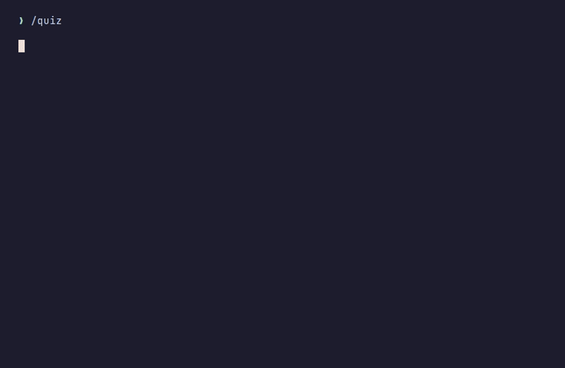
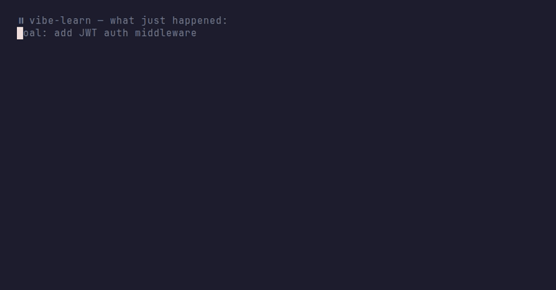
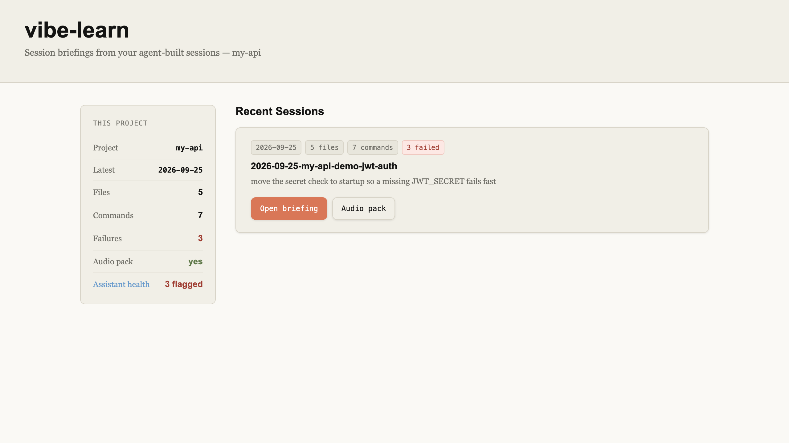
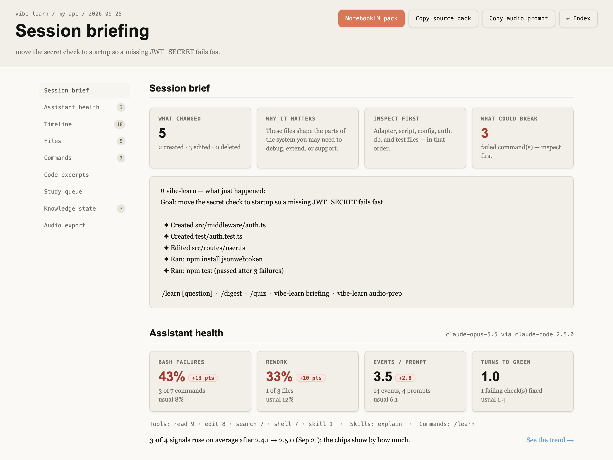

# vibe-learn

**Learn as your AI coding assistant builds.**

You can outsource your thinking, but you can't outsource your understanding.

vibe-learn watches what Claude Code, Codex, OpenCode, or Grok Build does during a session and helps you understand what was built, why, and how — without changing how you work.



Every file write, edit, and command is logged locally. `/learn` explains it, `/digest` reports on it, `/quiz` checks you actually understood it — and a small knowledge ledger brings shaky concepts back until they stick. Offline, bash + jq, no API keys.

**New here?** Follow the [Getting Started guide](GETTING_STARTED.md) for a step-by-step first session walkthrough.

---

## Install

### Claude Code — plugin (recommended)

Inside Claude Code:

```
/plugin marketplace add gkaria/vibe-learn
/plugin install vibe-learn@vibe-learn
```

That registers the hooks and adds `/vibe-learn:learn`, `/vibe-learn:digest`, and `/vibe-learn:quiz`. Updates arrive with `/plugin update vibe-learn@vibe-learn`. **Requires `jq`** — `brew install jq` / `apt-get install jq`.

### Codex, OpenCode, Grok Build — or Claude Code without the plugin system

```bash
curl -fsSL https://raw.githubusercontent.com/gkaria/vibe-learn/main/scripts/setup.sh | bash
```

Installs to `~/.vibe-learn/`, creates the `vibe-learn` CLI, and registers hooks globally for every AI assistant detected on your machine. If the Claude Code plugin is already enabled, the installer skips Claude hook registration so events are not logged twice. To update: re-run the same command. Latest release: [v0.8.0](https://github.com/gkaria/vibe-learn/releases/tag/v0.8.0).

---

## What happens automatically

After every AI response that touches files or runs commands, vibe-learn:

- Appends every action to `.vibe-learn/session-log.jsonl`
- Writes a pause summary to `.vibe-learn/pause-summary.txt`
- Injects that summary into your assistant's context at the start of the next session (Claude Code)
- Regenerates the session briefing in the background

The summary looks like this (the last line switches to `/vibe-learn:…` under the plugin install):

```
⏸ vibe-learn — what just happened:
Goal: add JWT auth middleware

  ✦ Created src/middleware/auth.ts
  ✦ Edited src/routes/user.ts
  ✦ Ran: npm install jsonwebtoken

 /learn [question]  ·  /digest  ·  /quiz  ·  vibe-learn briefing  ·  vibe-learn audio-prep
```

---

## When you want to understand

### Claude Code

```
/learn                              — explain what just happened
/learn why did we add middleware?   — answer a specific question
/digest                             — full structured session report
/quiz                               — check your understanding of this session
/quiz review                        — re-quiz concepts that are shaky or due again
/explain [file|topic]               — guided code tour of what was touched
```

With the plugin install the same commands are namespaced: `/vibe-learn:learn`, `/vibe-learn:digest`, `/vibe-learn:quiz`, `/vibe-learn:explain`.

### Codex

```
Use vibe-learn to learn what happened.
Use vibe-learn to answer: why did we install bcrypt?
Use vibe-learn to create a digest.
Use vibe-learn to quiz me on this session.
Use vibe-learn to explain src/middleware/auth.ts.
```

### OpenCode

```
/learn
/learn why did we add middleware?
/digest
/quiz
/explain src/middleware/auth.ts
```

### Grok Build

```
/learn
/learn why did we add middleware?
/digest
/quiz
/explain src/middleware/auth.ts
/vibe-learn
Use vibe-learn to learn what happened.
```

---

## What it looks like

Continuing the JWT session from above:

**`/learn`** — a plain-language recap, grounded in the actual log:



```
📘 What just happened:

• Added JWT auth middleware (src/middleware/auth.ts) — every request to a
  protected route now passes a token check before reaching the handler
• Wired it into the user routes (src/routes/user.ts), so /profile and
  /settings require a valid token
• Installed jsonwebtoken to sign and verify tokens
• Pattern worth knowing: middleware ordering — auth runs before the route
  handlers, so handlers can safely assume req.user exists
```

**`/digest`** — the structured session report:

```
## 📘 Session Digest

### What Was Built
JWT authentication for the user routes: a reusable auth middleware that
verifies tokens and attaches the decoded user to the request.

### Key Decisions
- Middleware over per-route checks — one enforcement point, no duplication
- jsonwebtoken over hand-rolling — battle-tested signing and expiry handling

### Patterns Used
- Express middleware chaining and ordering
- Fail-closed auth (reject first, then continue)

### Things to Study
- [ ] How JWT expiry and refresh interact
- [ ] What happens to routes registered before the auth middleware
- [ ] (carried over from Jul 2) Environment-based config for secrets
```

**`/quiz`** — one question at a time, graded against what actually happened:

```
Question 1 of 3: The auth check lives in middleware instead of inside each
route handler. What does that buy us — and what's the risk when someone
adds a new route later?

> no repeated checks in every handler, and new routes are protected
  automatically?

Right on the first half — one enforcement point, no duplication. One nuance
you missed: routes are only protected if they're registered *after* the
middleware. A new route mounted above app.use(auth) skips the check
entirely. That ordering is the thing to remember.

Question 2 of 3: ...
```

After the last question you get a recap, and the results are recorded:

```
Solid: jwt-verification, fail-closed-auth
Revisit: express-middleware-ordering — you had the what, not the when

  ✔ 3 concepts recorded to the knowledge ledger
```

That recording is the ledger at work — next session, `/learn` will nudge you if middleware ordering comes up again, and `/quiz review` will re-ask until it's solid.

**`/explain src/middleware/auth.ts`** — a guided tour when you want to actually read the code:

```
Entry point — src/middleware/auth.ts:8 exports `requireAuth`, mounted in
src/routes/user.ts:4 with app.use(requireAuth) before any route.

The spine
1. auth.ts:10  reads the Authorization header and strips "Bearer " — the
   only place the raw token is touched
2. auth.ts:14  jwt.verify(token, secret) — throws on bad signature *or*
   expiry, which is why there's a single catch below
3. auth.ts:19  req.user = payload — every handler after this can assume it
4. auth.ts:22  next() — only reached on success; failure returns 401 first

The edges — user.ts:4 must stay above the routes; a route mounted earlier
skips the check entirely. auth.ts:14 has no clock-skew tolerance.

Connections — user.ts (/profile, /settings) and, after this session,
nothing else. Adding a new protected router means mounting it below line 4.

You marked express-middleware-ordering shaky on July 11 — this is the code
behind it. Want me to quiz you on this, or save it to Obsidian?
```

---

## Check your understanding

Reading a digest feels like learning; answering questions proves it. `/quiz` asks 3–5 recall questions grounded in what actually happened this session — "why did we install bcrypt?", "which files would you touch to add a fourth adapter?" — one at a time, then tells you what you got right and what you missed.

Results go into `.vibe-learn/knowledge.json`, a small cross-session knowledge ledger. Concepts you answered shakily come back: `/quiz review` re-quizzes anything shaky or unreviewed for two weeks, `/learn` gives you a one-line heads-up when a shaky concept resurfaces in a new session, and `/digest`'s "Things to Study" accumulates across sessions instead of resetting.

The ledger is updated only by the learning commands (via `scripts/knowledge.sh`) — never by hooks, never over the network.

### Share what you learned

```bash
vibe-learn recap            # this week, to stdout
vibe-learn recap --days=30  # wider window
vibe-learn recap --save     # also writes .vibe-learn/recaps/<date>-recap.md
```

A markdown rollup built from the ledger, the session logs, and any saved digests — what you confirmed solid, what's still shaky, what you met but haven't been quizzed on, plus days active and files touched. Made to paste into a standup note, a learning journal, or a post:

```
# What I learned this week — my-api
2026-07-05 → 2026-07-11

**3 active day(s) · 7 prompt(s) · 14 file(s) touched · 22 command(s) run · quizzed on 2 day(s)**

## Confirmed solid (2)
- JWT verification — quizzed 2026-07-11
- Fail-closed auth — quizzed 2026-07-11

## Still shaky — revisit (1)
- Express middleware ordering — quizzed 2026-07-11: you had the what, not the when

## Met this week, not quizzed yet (1)
- Repository pattern — seen in 2 session(s), not quizzed yet

## Next
/quiz review — re-ask the shaky ones until they stick.
```

---

## Session briefing

After each session a local HTML briefing is auto-generated. Open it any time:

```bash
vibe-learn briefing          # regenerate and show path
```

Plugin-only install? The `vibe-learn` CLI is on the Bash tool's PATH inside Claude Code, so just ask Claude to run `vibe-learn briefing`. To have it in your own shell too, run the `curl` installer above — it adds the CLI and skips the duplicate hooks.





The briefing includes: maintainer brief (what changed / why it matters / inspect first / what could break), session timeline with filter buttons, file tour with colour-coded area badges, command log with failure highlighting, syntax-highlighted diff, a study queue, and a NotebookLM-ready source pack. When `.vibe-learn/knowledge.json` exists, the study queue leads with your shaky concepts, the page gains a Knowledge State section, the source pack gains a "Your knowledge state" table, and the audio prompt asks NotebookLM to dwell on what you've struggled with.

No server, no build step, no external assets — just a static HTML file that opens directly from disk.

## Audio overview with NotebookLM

Every session briefing also produces a markdown source pack at `.vibe-learn/briefing/exports/<session>-notebooklm-pack.md`. This is a structured document containing the session summary, timeline, file list, commands, and diff excerpt — formatted for upload to [NotebookLM](https://notebooklm.google.com).

To prepare the upload in one step:

```bash
vibe-learn audio-prep
```

This:
1. Finds the latest pack in `.vibe-learn/briefing/exports/`
2. Copies the file path to your clipboard
3. Opens NotebookLM in your browser
4. Opens the exports folder in Finder
5. Prints the audio prompt to paste when NotebookLM asks to customise the overview

The audio prompt tells NotebookLM to produce a maintainer-focused overview — what changed, why it matters, what to inspect first, what could break — pitched at someone who owns and needs to support the codebase. Upload the pack as a source, generate an Audio Overview, and listen on your commute.

---

## Supported assistants

| Assistant | How vibe-learn integrates |
|-----------|--------------------------|
| **Claude Code** | Plugin (`/plugin install vibe-learn@vibe-learn`) or JSON hooks in `settings.json`; native `/learn`, `/digest`, `/quiz`, and `/explain` slash commands |
| **Codex App/CLI** | Inline TOML hooks in `config.toml`, global `vibe-learn` skill, prompt-file fallbacks |
| **OpenCode** | JavaScript plugin in `.opencode/plugins/`, native `/learn`, `/digest`, `/quiz`, and `/explain` commands |
| **Grok Build** | JSON hooks in `${GROK_HOME:-~/.grok}/hooks/vibe-learn.json`, native `/learn`, `/digest`, `/quiz`, `/explain`, and a `/vibe-learn` skill |

Auto-detected on install. To target one: `--assistant=claude-code`, `--assistant=codex`, `--assistant=opencode`, or `--assistant=grok`.

Project Grok hooks stay inert until the folder is trusted (`/hooks-trust` or `grok --trust`). If Claude Code vibe-learn is also installed, Grok may run both hook sets; set `[compat.claude] hooks = false` in `~/.grok/config.toml` to avoid double-logging.

---

## Per-project install (optional)

Global install covers most workflows. If you want hooks scoped to one project, or want to commit the config so teammates get vibe-learn automatically:

```bash
cd your-project
vibe-learn install
```

Detects which assistants the project already uses and installs only those. Adds `.vibe-learn/` to `.gitignore`.

---

## Obsidian integration

Save learnings to an [Obsidian](https://obsidian.md) vault and recall them across sessions:

```
/learn obsidian                          — save a learn note to your vault
/learn obsidian:recall authentication    — search past notes on a topic (read-only)
/digest obsidian                         — save the session digest to your vault
/digest obsidian:recall                  — digest enriched with connections to previous work
```

On first use, Claude asks for your vault path and offers to save it to `.vibe-learn/obsidian.json`. Equivalent Codex requests work the same way via the skill.

---

## How it works

Four lifecycle hooks, all fast and offline:

| Hook | Script | What it does |
|------|--------|--------------|
| `SessionStart` | `bootstrap.sh` | Creates `.vibe-learn/`, rotates previous log |
| `UserPromptSubmit` | `capture-prompt.sh` | Logs your prompt with a turn counter |
| `PostToolUse` | `observe.sh` | Appends one JSONL line per tool event (<50ms) |
| `Stop` | `pause-summary.sh` | Writes summary, injects context, generates session briefing |

On-demand (never from hooks): `vibe-learn briefing`, `vibe-learn recap`, `vibe-learn audio-prep`, and the knowledge helper `scripts/knowledge.sh`.

All data stays in `.vibe-learn/` inside your project. No network calls, no external services.

---

## Testing

```bash
brew install bats-core    # macOS
apt-get install bats      # Linux

bats tests/               # 282 tests
```

---

## Requirements

- **Bash** (POSIX-compatible)
- **jq** (`brew install jq` / `apt-get install jq`)
- **Claude Code**, **Codex App/CLI**, **OpenCode**, or **Grok Build**

---

## Releases

- **[v0.8.0](https://github.com/gkaria/vibe-learn/releases/tag/v0.8.0) (this branch):** Grok Build as a first-class assistant — `/learn`, `/digest`, `/quiz`, `/vibe-learn` skill · `--assistant=grok` · auto-detect via `grok` / `~/.grok` / `GROK_HOME`
- **v0.7.0:** Active recall — `/quiz` and `/quiz review` · cross-session knowledge ledger (`knowledge.json`) · cumulative "Things to Study" in digests
- **v0.6.0:** OpenCode support · session briefing · auto-generated briefing after each response · turn-structured session log · `vibe-learn audio-prep` · `vibe-learn briefing`
- **v0.5.5:** Multi-assistant support — Claude Code and Codex, assistant auto-detection, generic adapter layout
- **v0.5.0:** Obsidian integration — save notes, recall past learnings with `obsidian:recall`

---

## Contributing

Issues and PRs welcome — see [CONTRIBUTING.md](CONTRIBUTING.md) for the dev loop, the adapter layout, and how to add a learning command. Looking for a first task? [docs/community/good-first-issues.md](docs/community/good-first-issues.md) has five scoped ones.

## License

MIT — see [LICENSE](LICENSE). Copyright © 2026 Gaurang Karia.
