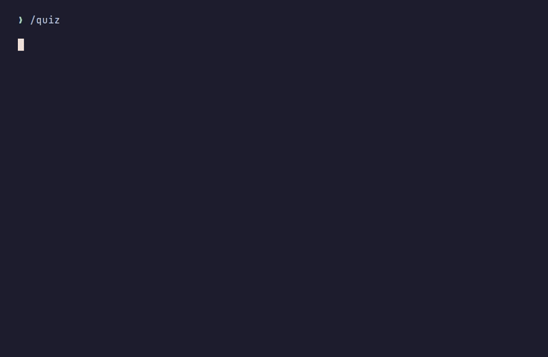
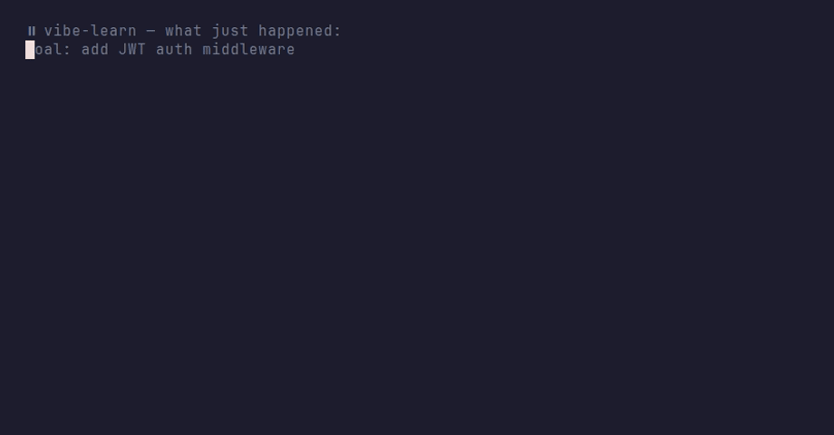
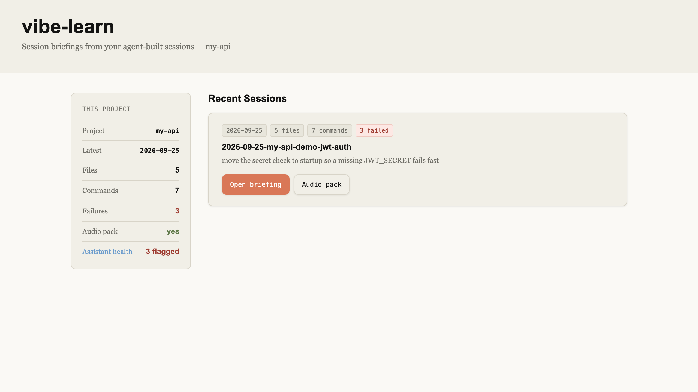
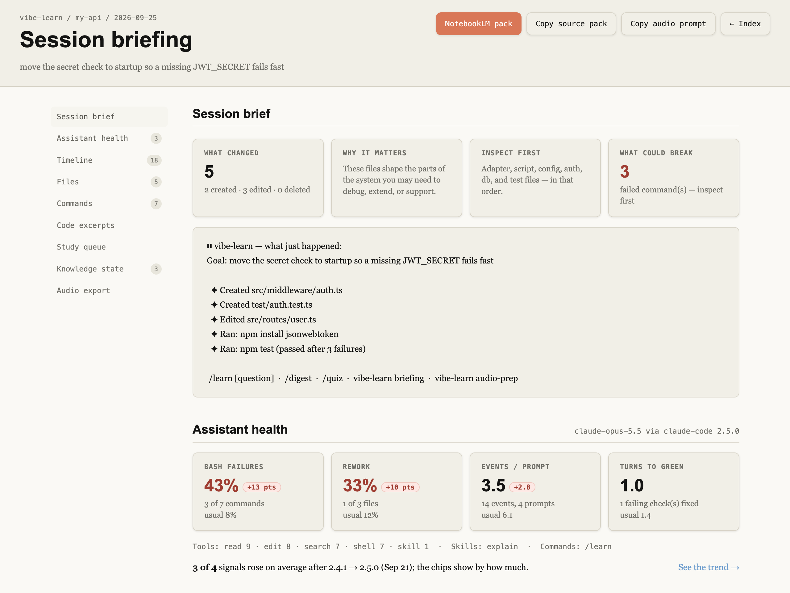

# vibe-learn

**Learn as your AI coding assistant builds.**

You can outsource your thinking, but you can't outsource your understanding.

vibe-learn watches Claude Code, GitHub Copilot CLI, Codex, OpenCode, Grok Build, or Cursor and helps you understand what was built, why, and how — without changing how you work. Offline, bash + jq, no API keys.

## Try it (under a minute)

**Claude Code** (plugin):

```
/plugin marketplace add gkaria/vibe-learn
/plugin install vibe-learn@vibe-learn
```

**Everyone else** (or Claude Code without plugins):

```bash
curl -fsSL https://raw.githubusercontent.com/gkaria/vibe-learn/main/scripts/setup.sh | bash
```

Then work as usual. After the assistant writes or edits a file, type `/learn`.

Requires `jq` — `brew install jq` / `apt-get install jq`.



## New here?

1. **Install** with the plugin or the curl line above.
2. **Work normally** — give the assistant a real task that writes or edits files. vibe-learn logs in the background.
3. **Type `/learn`** — a recap grounded in what just happened. Then `/quiz` if you want to check you understood it.

The [10-minute walkthrough](GETTING_STARTED.md) covers digest, briefing, and audio.

## Commands

| Command | What it does |
|---------|----------------|
| `/learn [question]` | Explain what just happened, or answer a specific question from the session log |
| `/digest` | Structured session report: what was built, decisions, patterns, things to study |
| `/quiz [topic\|review]` | Recall questions, one at a time; `review` re-asks shaky or stale concepts |
| `/explain [file\|topic]` | Guided code tour of a file or subsystem the session touched |

Results land in a small local knowledge ledger. Concepts you answer shakily come back until they stick.

### How your assistant maps it

| Assistant | How you invoke it |
|-----------|-------------------|
| **Claude Code** | `/learn` — plugin: `/vibe-learn:learn` |
| **GitHub Copilot CLI** | `Use /learn` inside a prompt (a skill reference, not a built-in slash command) |
| **Codex** | `Use vibe-learn to learn what happened.` |
| **OpenCode** | `/learn` |
| **Grok Build** | `/learn` or `/vibe-learn` |
| **Cursor** | `/learn` or `/vibe-learn` |

Install details, caveats, and per-project setup: [docs/assistants.md](docs/assistants.md).

## What it looks like

Continuing a JWT session. `/learn` is a plain-language recap; `/digest`, `/quiz`, and `/explain` go deeper. The session briefing is a local HTML page you can open any time.



```
📘 What just happened:

• Added JWT auth middleware (src/middleware/auth.ts) — every request to a
  protected route now passes a token check before reaching the handler
• Wired it into the user routes (src/routes/user.ts), so /profile and
  /settings require a valid token
• Installed jsonwebtoken to sign and verify tokens
• Pattern worth knowing: middleware ordering — auth runs before the route
  handlers, so handlers can safely assume req.user exists
```

**`/digest`**

```
## 📘 Session Digest

### What Was Built
JWT authentication for the user routes: a reusable auth middleware that
verifies tokens and attaches the decoded user to the request.

### Key Decisions
- Middleware over per-route checks — one enforcement point, no duplication
- jsonwebtoken over hand-rolling — battle-tested signing and expiry handling

### Patterns Used
- Express middleware chaining and ordering
- Fail-closed auth (reject first, then continue)

### Things to Study
- [ ] How JWT expiry and refresh interact
- [ ] What happens to routes registered before the auth middleware
- [ ] (carried over from Jul 2) Environment-based config for secrets
```

**`/quiz`**

```
Question 1 of 3: The auth check lives in middleware instead of inside each
route handler. What does that buy us — and what's the risk when someone
adds a new route later?

> no repeated checks in every handler, and new routes are protected
  automatically?

Right on the first half — one enforcement point, no duplication. One nuance
you missed: routes are only protected if they're registered *after* the
middleware. A new route mounted above app.use(auth) skips the check
entirely. That ordering is the thing to remember.

Solid: jwt-verification, fail-closed-auth
Revisit: express-middleware-ordering — you had the what, not the when
```

**`/explain src/middleware/auth.ts`**

```
Entry point — src/middleware/auth.ts:8 exports `requireAuth`, mounted in
src/routes/user.ts:4 with app.use(requireAuth) before any route.

The spine
1. auth.ts:10  reads the Authorization header and strips "Bearer "
2. auth.ts:14  jwt.verify(token, secret) — throws on bad signature or expiry
3. auth.ts:19  req.user = payload — every handler after this can assume it
4. auth.ts:22  next() — only reached on success; failure returns 401 first

The edges — user.ts:4 must stay above the routes; a route mounted earlier
skips the check entirely.
```

**Session briefing** — `vibe-learn briefing` regenerates a static HTML page (no server):





## Deeper

- [Getting started](GETTING_STARTED.md) — first session, about 10 minutes
- [Assistants](docs/assistants.md) — install details, per-assistant commands, per-project
- [How it works](docs/how-it-works.md) — hooks, the session log, the knowledge ledger
- [Session briefing & audio](docs/briefing.md) — HTML briefing, NotebookLM
- [Assistant health](docs/health.md) — is the assistant having a bad week?
- [Obsidian](docs/obsidian.md) — save and recall learn notes
- [Changelog](CHANGELOG.md) · [Releases](https://github.com/gkaria/vibe-learn/releases)

## Requirements

- **Bash** (POSIX-compatible)
- **jq** (`brew install jq` / `apt-get install jq`)
- **Claude Code**, **GitHub Copilot CLI** (verified with 1.0.84-4), **Codex App/CLI**, **OpenCode**, **Grok Build**, or **Cursor**

## Contributing

Issues and PRs welcome — see [CONTRIBUTING.md](CONTRIBUTING.md). Looking for a first task? [docs/community/good-first-issues.md](docs/community/good-first-issues.md).

## License

MIT — see [LICENSE](LICENSE). Copyright © 2026 Gaurang Karia.
