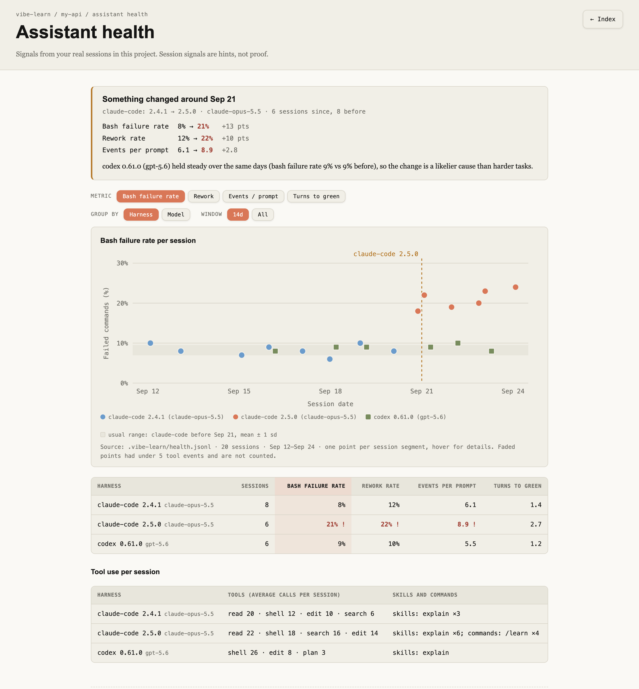

# Assistant health

Part of [vibe-learn](../README.md). The learning commands (`/learn`, `/digest`, `/quiz`) use the
session log to check what you understood. This page covers the other thing the same log can tell
you: whether the assistant itself is still behaving the way it did last week.

---

## Is my assistant having a bad week?

Assistants change under you: a harness update, a new default model, a different effort level. When a session feels off, it's hard to tell whether the assistant got worse or the task was just harder. vibe-learn keeps a small history to help answer that.

When a session ends, vibe-learn saves one row of counts for it: how often shell commands failed, how often the same file was reworked across turns, tool events per prompt, turns from a failing check to a passing one, and, when the host's session record is available, which tool families, skills, and commands the session used. It then compares the sessions since the latest version, model, or effort change with the ones before it:

```bash
vibe-learn health                  # last 14 days, grouped by harness
vibe-learn health --by=model       # group by model instead
vibe-learn health --all            # pool every project (~/.vibe-learn/health.jsonl)
vibe-learn health --save --redact  # markdown report to share, project names replaced
```

```
Assistant health - my-api - last 14 days (20 sessions)

Flagged
  claude-code 2.5.0 (claude-opus-5.5), since Sep 21 (2.4.1 → 2.5.0):
    bash failure rate    8% -> 21%
    rework rate         12% -> 22%
    events per prompt   6.1 -> 8.9
  codex 0.61.0 (gpt-5.6) held steady over the same days (bash failure rate 9% vs 9% before), so the change is a likelier cause than harder tasks.

                                       sessions  bash fail  rework  events/prompt  turns to green
  claude-code 2.4.1 · claude-opus-5.5         8         8%     12%            6.1             1.4
  claude-code 2.5.0 · claude-opus-5.5         6      21% !   22% !          8.9 !             2.7
  codex 0.61.0 · gpt-5.6                      6         9%     10%            5.5             1.2

Tool use per session
  claude-code 2.4.1 · claude-opus-5.5  read 20 · shell 12 · edit 10 · search 6  (skills: explain ×3)
  claude-code 2.5.0 · claude-opus-5.5  read 22 · shell 18 · search 16 · edit 14  (skills: explain ×6; commands: /learn ×4)
  codex 0.61.0 · gpt-5.6               shell 26 · edit 8 · plan 3  (skills: explain)

Current session (in progress, claude-code): bash failure rate 43% · rework rate 33% · events per prompt 3.5 · turns to green 1.0
Current session tools: read 9 · edit 8 · search 7 · shell 7 · skill 1; skills: explain; commands: /learn

These come from your real work, not a controlled test: harder tasks look like a worse assistant.
```

The session briefing shows the same analysis as a trend page, linked from the health card and the index:



How to read it:

- A signal is flagged when its average since the change is at least 10 points higher (rates) or 2 higher (counts), with at least 5 sessions on each side. Until then you'll see "building your baseline".
- "Held steady" appears when another assistant has at least three eligible sessions before and after the change and its own signal stays within the threshold. That points at the change rather than at harder tasks.
- Tool use is context, not a verdict. A jump in search calls or a skill that stopped loading can explain a flag, but it is never flagged on its own.
- These are hints from your real work, not a benchmark.

Rows hold counts and names only, never prompts, commands, file paths, or tool arguments. Tool and skill counts are read from an assistant's own session record when available; Copilot CLI currently records the hook-derived metrics without model, version, or tool and skill counts. Nothing is sent anywhere. `--redact` replaces project names, but skill and MCP server names stay in the report, so check them before you share it.

History goes to `.vibe-learn/health.jsonl` and, for `--all`, to `~/.vibe-learn/health.jsonl`. To keep it per-project, put `{"health":{"global_log":false}}` in `~/.vibe-learn/config.json`; to turn it off, use `{"health":{"enabled":false}}`. A project's `.vibe-learn/config.json` overrides the global one.
